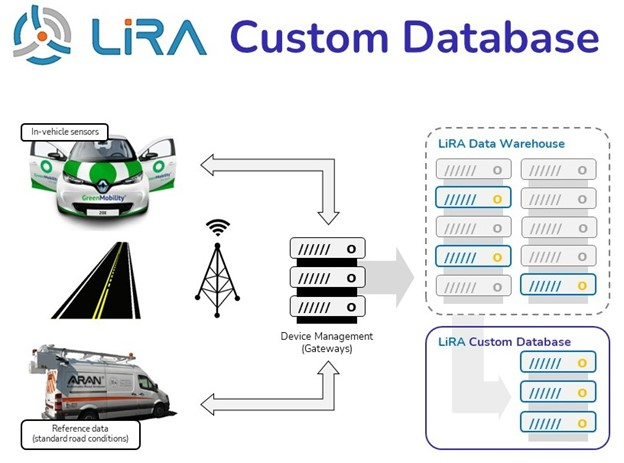

# LiRA-CD
Live Road Assessment Custom Dataset (LiRA-CD) is an open-source dataset for road condition modeling and research. The aim of this dataset is to provide researchers and pavement engineers with a vehicle dataset that is open-source and suitable for developing large-scale road condition monitoring methods. Specifically, this dataset focuses on linking in-vehicle sensor data collected by regular cars to standard road condition parameters utilized by public road agencies (i.e., parameters used as input for planning and management of road networks). 

The LiRA-CD contains 1796 kilometer of road data from highway and urban roads in the Copenhagen area collected during the LiRA project (see e.g., [lira2020](https://lira-project.dk/) and [levenberg2021](https://doi.org/10.1177/03611981211016852). It includes more than 50 in-vehicle sensors signals from Renault Zoe electric cars operated by GreenMobility (GM) and 92 road condition parameters collected with standard vehicles operated by the Danish Road Directorate (DRD).

 <b>Figure 1:</b> Graphical outline of the data collection and data infrastructure in the LiRA project [lira2020](https://lira-project.dk/). 

## Installation
* Download the package on your PC.
* Open file explorer or similar
* Go to the directory 'LiRA-CD'

## How to contribute
*	To make changes or add a new function: <i>(i)</i> For the repository (make your own separate copy), <i>(ii)</i> make changes, and <i>(iii)</i> open a 'pull request'. Once approved, it can be merged into the master branch. If you wish to chat beforehand about your contribution, open an issue or email to asmusskar@gmail.com.
*	If you find a bug in the code: open an 'issue' to notify contributors and create an official record.

Before contributing, please consider how your function fits into ALVA. At a minimum, functions must be well-documented and compatible with [OCTAVE](https://www.gnu.org/software/octave/index), not using any third party components. 

# References
Skar, Asmus and Tommy Sonne Alstrøm (2023). Live Road Assessment Custom Dataset (LiRA-CD). Technical University of Denmark. Dataset.

Skar et al., (2023). LiRA-CD: An Open-Source Dataset for Road Condition Modeling and Research. Data in Brief, in review
